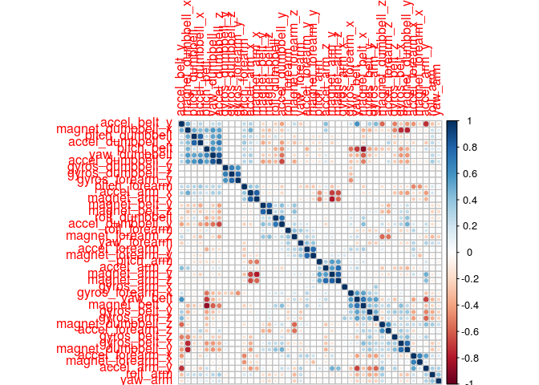

# Practical Machine Learning: Course Project
gengelbeck  
22 December 2014  


```
## Loading required package: lattice
## Loading required package: ggplot2
## randomForest 4.6-10
## Type rfNews() to see new features/changes/bug fixes.
```

# Abstract
The goal of this project is to predict the manner in which users exercised. Using a random forest model we were able to correctly classify 19 of 20 (95 percent) of the activities in the test data set correctly.

This was outside the expected accuracy range given the accuracy of our model against our validation data set. (The 95 percent confidence interval for our validation data set was between 0.9867 and 0.9921.) This may suggest that our model could be made more accurate or it may reflect variability due to the small number of test cases.

# Introduction

## Background
Using sensor data we set out to predict the activities of participants who are lifting an exercise weight. While desirable, our goal *was not* to create a predictive model that was easy to interpret: For us, predictive accuracy was paramount, understanding was secondary.

# Method

## Data Collection
For our analysis we used a data set of 19,642 weight lifting recordings from 6 participants using a 1.25kg dumbbell over an 8 hour period.

This data set contains our outcome variable (classe), a participant identifier (user_name), and  sensor covariates. Briefly, the data set contains:

  + An identifier for the weight-lifting exercise a participant was engaged in. (Our outcome variable.)
  + A participant identifier,
  + 157 time and frequency domain variables capturing:
    + Pitch, roll, and yaw of the arm, forearm, and dumbbell sensors,
    + Angular velocity from the gyroscope.

Details about this data set are available at the [Groupware LES HAR Project](http://groupware.les.inf.puc-rio.br/har) where the data set is available for download.

## Splitting the dataset
We partitioned our original data set into two separate data sets: a training set with about 70 percent of our observations, and validation data set containing about 30 percent of our observations.

A final test data set of 20 test cases was provided. The test data set
was used once to test the prediction accuracy of our final model.


## Exploratory Analysis
An exploratory analysis was performed by examining tables and plots of our data. Exploratory analysis was used to:

  + Identify variables with no practical value
  + Identify variables with near zero variability
  + Verify the quality of the data, and
  + Identify missing values -- none were found

### Variables of no practical value
Since we wished to predict the exercise engaged in independent of date and time we eliminated *raw_timestamp_part_1*,  *raw_timestamp_part_2*,	and *cvtd_timestamp* as variables in the training data set.

Since we wished to predict the exercise engaged in independent of date and time we eliminated *raw_timestamp_part_1*,  *raw_timestamp_part_2*,  and *cvtd_timestamp* as variables in the training data set.

We eliminated *X*, *user_name*, *new_window* and *num_window* since these were measurement labels and not predictors.


We eliminated summary statistics for the data set. These were the variables beginning with var_, kurtosis_, max_, min_, avg_, stddev_, amplitude_, total_, and skewness_.


## Predictor filtering
### Elimiate near-zero varability covariates
We checked to see if we had covariates with near-zero variability. There were none.


### Elminate unneeded corvariates
Given the large number of highly correlated predictors, we set about eliminating unneeded covariates. We used the procedure suggested by Kuhn & Johnson (2013) p. 47 for reducing the effects of multicollinearity. Using this procedure, 6 of 52 covariates were removed from the data set, leaving us with 46 covariates. (The covariates removed were: accel_belt_z, roll_belt, accel_belt_x, gyros_arm_y, gyros_forearm_z, and gyros_dumbbell_x)


### Correlation of remaining predictors
 

## Random Forest Model
We created a Random Forest Model to predict activities in the training
data set. We fit a random forest models of 10 trees to our test data set using R’s randomForest
package. (See [4] for a discussion of the randomForest package.) The resulting random forest
model classified 13729 of 13737 correctly for a correct classification rate of about 0.99.


#### Fit for the training data set
Our random forest model had a 99.9 percent accuracy rate. We accepted the model and applied it to our validation data set.

```
## Loading required namespace: e1071
```

```
## Confusion Matrix and Statistics
## 
##           Reference
## Prediction    A    B    C    D    E
##          A 3906    1    0    0    0
##          B    0 2657    1    0    0
##          C    0    0 2395    1    0
##          D    0    0    0 2250    1
##          E    0    0    0    1 2524
## 
## Overall Statistics
##                                           
##                Accuracy : 0.9996          
##                  95% CI : (0.9992, 0.9999)
##     No Information Rate : 0.2843          
##     P-Value [Acc > NIR] : < 2.2e-16       
##                                           
##                   Kappa : 0.9995          
##  Mcnemar's Test P-Value : NA              
## 
## Statistics by Class:
## 
##                      Class: A Class: B Class: C Class: D Class: E
## Sensitivity            1.0000   0.9996   0.9996   0.9991   0.9996
## Specificity            0.9999   0.9999   0.9999   0.9999   0.9999
## Pos Pred Value         0.9997   0.9996   0.9996   0.9996   0.9996
## Neg Pred Value         1.0000   0.9999   0.9999   0.9998   0.9999
## Prevalence             0.2843   0.1935   0.1744   0.1639   0.1838
## Detection Rate         0.2843   0.1934   0.1743   0.1638   0.1837
## Detection Prevalence   0.2844   0.1935   0.1744   0.1639   0.1838
## Balanced Accuracy      0.9999   0.9998   0.9997   0.9995   0.9998
```
#### Make predictions for the validation data set
Our random forest model had a 98.9 percent accuracy rate - A drop of 1 percent. We accepted this as our model for submission and we next applied it to the 20 test cases.

```
## Confusion Matrix and Statistics
## 
##           Reference
## Prediction    A    B    C    D    E
##          A 1668    9    0    0    0
##          B    4 1122    9    0    0
##          C    0    6 1009   16    0
##          D    1    2    6  947    2
##          E    1    0    2    1 1080
## 
## Overall Statistics
##                                           
##                Accuracy : 0.99            
##                  95% CI : (0.9871, 0.9924)
##     No Information Rate : 0.2845          
##     P-Value [Acc > NIR] : < 2.2e-16       
##                                           
##                   Kappa : 0.9873          
##  Mcnemar's Test P-Value : NA              
## 
## Statistics by Class:
## 
##                      Class: A Class: B Class: C Class: D Class: E
## Sensitivity            0.9964   0.9851   0.9834   0.9824   0.9982
## Specificity            0.9979   0.9973   0.9955   0.9978   0.9992
## Pos Pred Value         0.9946   0.9885   0.9787   0.9885   0.9963
## Neg Pred Value         0.9986   0.9964   0.9965   0.9965   0.9996
## Prevalence             0.2845   0.1935   0.1743   0.1638   0.1839
## Detection Rate         0.2834   0.1907   0.1715   0.1609   0.1835
## Detection Prevalence   0.2850   0.1929   0.1752   0.1628   0.1842
## Balanced Accuracy      0.9971   0.9912   0.9895   0.9901   0.9987
```

## Predictions for the test data set
Finally, we tested our random forest model against our test data set. We were able to correctly
classify 19 of 20 activities for a correct classification rate of about 0.95. This was a drop of
about 0.039 in the accuracy rate from our validation data set.


## Results

### Predictive Accuracy
We created a random forest model that was able to correctly classify about 95 percent of the
activities in our test data set. The table below presents the confusion matrix for our random forest
model when applied to the validation data set.

The confusion matrix shows that most prediction confusions occurred when predicting activities standing (C) and standing down (D). With our test data set, 35 of 62 (about 57 percent) of misclassifications were
confusions between standing and standing down. See the table below for the table of confusions for
our validation data set.

Table: Confusion matrix the resulted from using the random forest model to predict activities in
our test data set. Observed misclassification counts have been highlighted. The rows are predictions while columns are observed activities.
<!-- html table generated in R 3.0.2 by xtable 1.7-4 package -->
<!-- Fri Dec 19 12:34:02 2014 -->
<table border=1>
<tr> <th>  </th> <th> A </th> <th> B </th> <th> C </th> <th> D </th> <th> E </th>  </tr>
  <tr> <td align="right"> A </td> <td align="right"> 1668 </td> <td align="right">   9 </td> <td align="right">   0 </td> <td align="right">   0 </td> <td align="right">   0 </td> </tr>
  <tr> <td align="right"> B </td> <td align="right">   4 </td> <td align="right"> 1122 </td> <td align="right">   9 </td> <td align="right">   0 </td> <td align="right">   0 </td> </tr>
  <tr> <td align="right"> C </td> <td align="right">   0 </td> <td align="right">   6 </td> <td align="right"> 1009 </td> <td align="right">  16 </td> <td align="right">   0 </td> </tr>
  <tr> <td align="right"> D </td> <td align="right">   1 </td> <td align="right">   2 </td> <td align="right">   6 </td> <td align="right"> 947 </td> <td align="right">   2 </td> </tr>
  <tr> <td align="right"> E </td> <td align="right">   1 </td> <td align="right">   0 </td> <td align="right">   2 </td> <td align="right">   1 </td> <td align="right"> 1080 </td> </tr>
   </table>

### Covariate Importance
Our random forest model used the 42 covariates available to it. As the Figure below shows, not all our were
covariates were equally important as predictors.

The ten most important predictors as measured by Mean Decrease in Gini coefficients are shown
in the Table below. These covariates may indicates the relative importance of distinguishing energy and
acceleration caused by humans and that caused by gravitational forces.

<!-- html table generated in R 3.0.2 by xtable 1.7-4 package -->
<!-- Fri Dec 19 12:34:02 2014 -->
<table border=1>
<tr> <th>  </th> <th> names </th> <th> MeanDecreaseGini </th> <th> Proportion </th>  </tr>
  <tr> <td align="right"> 1 </td> <td> yaw_belt </td> <td align="right"> 701.33 </td> <td align="right"> 0.06 </td> </tr>
  <tr> <td align="right"> 2 </td> <td> pitch_belt </td> <td align="right"> 590.75 </td> <td align="right"> 0.05 </td> </tr>
  <tr> <td align="right"> 3 </td> <td> roll_forearm </td> <td align="right"> 524.24 </td> <td align="right"> 0.05 </td> </tr>
  <tr> <td align="right"> 4 </td> <td> magnet_dumbbell_z </td> <td align="right"> 512.21 </td> <td align="right"> 0.05 </td> </tr>
  <tr> <td align="right"> 5 </td> <td> pitch_forearm </td> <td align="right"> 484.12 </td> <td align="right"> 0.04 </td> </tr>
  <tr> <td align="right"> 6 </td> <td> magnet_dumbbell_y </td> <td align="right"> 462.88 </td> <td align="right"> 0.04 </td> </tr>
  <tr> <td align="right"> 7 </td> <td> magnet_belt_y </td> <td align="right"> 405.96 </td> <td align="right"> 0.04 </td> </tr>
  <tr> <td align="right"> 8 </td> <td> magnet_dumbbell_x </td> <td align="right"> 388.12 </td> <td align="right"> 0.04 </td> </tr>
  <tr> <td align="right"> 9 </td> <td> magnet_belt_z </td> <td align="right"> 384.64 </td> <td align="right"> 0.04 </td> </tr>
  <tr> <td align="right"> 10 </td> <td> gyros_belt_z </td> <td align="right"> 382.41 </td> <td align="right"> 0.04 </td> </tr>
  <tr> <td align="right"> 11 </td> <td> roll_arm </td> <td align="right"> 376.85 </td> <td align="right"> 0.03 </td> </tr>
  <tr> <td align="right"> 12 </td> <td> accel_dumbbell_z </td> <td align="right"> 355.58 </td> <td align="right"> 0.03 </td> </tr>
  <tr> <td align="right"> 13 </td> <td> roll_dumbbell </td> <td align="right"> 330.27 </td> <td align="right"> 0.03 </td> </tr>
  <tr> <td align="right"> 14 </td> <td> gyros_dumbbell_y </td> <td align="right"> 312.07 </td> <td align="right"> 0.03 </td> </tr>
  <tr> <td align="right"> 15 </td> <td> accel_forearm_x </td> <td align="right"> 260.27 </td> <td align="right"> 0.02 </td> </tr>
  <tr> <td align="right"> 16 </td> <td> magnet_arm_x </td> <td align="right"> 257.37 </td> <td align="right"> 0.02 </td> </tr>
  <tr> <td align="right"> 17 </td> <td> accel_dumbbell_y </td> <td align="right"> 250.53 </td> <td align="right"> 0.02 </td> </tr>
  <tr> <td align="right"> 18 </td> <td> accel_dumbbell_x </td> <td align="right"> 246.88 </td> <td align="right"> 0.02 </td> </tr>
  <tr> <td align="right"> 19 </td> <td> yaw_arm </td> <td align="right"> 240.79 </td> <td align="right"> 0.02 </td> </tr>
  <tr> <td align="right"> 20 </td> <td> magnet_forearm_x </td> <td align="right"> 218.61 </td> <td align="right"> 0.02 </td> </tr>
  <tr> <td align="right"> 21 </td> <td> magnet_arm_y </td> <td align="right"> 213.38 </td> <td align="right"> 0.02 </td> </tr>
  <tr> <td align="right"> 22 </td> <td> magnet_forearm_y </td> <td align="right"> 212.85 </td> <td align="right"> 0.02 </td> </tr>
  <tr> <td align="right"> 23 </td> <td> magnet_forearm_z </td> <td align="right"> 211.84 </td> <td align="right"> 0.02 </td> </tr>
  <tr> <td align="right"> 24 </td> <td> yaw_dumbbell </td> <td align="right"> 208.82 </td> <td align="right"> 0.02 </td> </tr>
  <tr> <td align="right"> 25 </td> <td> accel_forearm_z </td> <td align="right"> 179.66 </td> <td align="right"> 0.02 </td> </tr>
  <tr> <td align="right"> 26 </td> <td> magnet_belt_x </td> <td align="right"> 177.11 </td> <td align="right"> 0.02 </td> </tr>
  <tr> <td align="right"> 27 </td> <td> pitch_arm </td> <td align="right"> 167.94 </td> <td align="right"> 0.02 </td> </tr>
  <tr> <td align="right"> 28 </td> <td> magnet_arm_z </td> <td align="right"> 157.15 </td> <td align="right"> 0.01 </td> </tr>
  <tr> <td align="right"> 29 </td> <td> accel_arm_x </td> <td align="right"> 148.67 </td> <td align="right"> 0.01 </td> </tr>
  <tr> <td align="right"> 30 </td> <td> gyros_arm_x </td> <td align="right"> 145.94 </td> <td align="right"> 0.01 </td> </tr>
  <tr> <td align="right"> 31 </td> <td> accel_belt_y </td> <td align="right"> 142.75 </td> <td align="right"> 0.01 </td> </tr>
  <tr> <td align="right"> 32 </td> <td> accel_forearm_y </td> <td align="right"> 142.62 </td> <td align="right"> 0.01 </td> </tr>
  <tr> <td align="right"> 33 </td> <td> pitch_dumbbell </td> <td align="right"> 139.30 </td> <td align="right"> 0.01 </td> </tr>
  <tr> <td align="right"> 34 </td> <td> yaw_forearm </td> <td align="right"> 134.71 </td> <td align="right"> 0.01 </td> </tr>
  <tr> <td align="right"> 35 </td> <td> gyros_forearm_y </td> <td align="right"> 130.94 </td> <td align="right"> 0.01 </td> </tr>
  <tr> <td align="right"> 36 </td> <td> accel_arm_y </td> <td align="right"> 130.02 </td> <td align="right"> 0.01 </td> </tr>
  <tr> <td align="right"> 37 </td> <td> gyros_belt_x </td> <td align="right"> 112.04 </td> <td align="right"> 0.01 </td> </tr>
  <tr> <td align="right"> 38 </td> <td> accel_arm_z </td> <td align="right"> 110.83 </td> <td align="right"> 0.01 </td> </tr>
  <tr> <td align="right"> 39 </td> <td> gyros_belt_y </td> <td align="right"> 103.59 </td> <td align="right"> 0.01 </td> </tr>
  <tr> <td align="right"> 40 </td> <td> gyros_dumbbell_z </td> <td align="right"> 72.73 </td> <td align="right"> 0.01 </td> </tr>
  <tr> <td align="right"> 41 </td> <td> gyros_arm_z </td> <td align="right"> 66.28 </td> <td align="right"> 0.01 </td> </tr>
  <tr> <td align="right"> 42 </td> <td> gyros_forearm_x </td> <td align="right"> 61.83 </td> <td align="right"> 0.01 </td> </tr>
   </table>

To increase the comprehensibility of the model – not a goal for us – it may be worthwhile
to reduce the number of covariates used by the model.

## Conclusions

### Predicting Activities
We were able to create a random forest model that was able to classify 95 percent of the
activities in our test data set correctly.

Our accuracy was outside the expected accuracy range given the accuracy of our model against our validation data set. (The 95 percent confidence interval for our validation data set was between 0.9867 and 0.9921.) This may suggest that our model could be made more accurate or it may reflect variability due to the small number of test cases.

### Limitations
Our understanding of the covariates provided in the data set was limited. Perhaps
many of the covariates in the data set could be combined into more accurate and sensible activity
measures with physical correlates that would be easier to interpret and communicate. Greater
knowledge of the domain may provide us with a model that is both understandable and accurate.

Additionally, our model is limited to the activities covered by the experiment. Our predictive
model would not generalize to other activities that are not in the original model (legs lifts,...).


# References
[1] Kuhn, M., & Johnson, K. (2013). *Applied Predictive Modeling*. Springer: New York.

[2] Ugulino, W., Cardador, D., Vega, K.; Velloso, E., Milidiu, R., Fuks, H. (2012). Wearable Computing: Accelerometers' Data Classification of Body Postures and Movements. *Proceedings of 21st Brazilian Symposium on Artificial Intelligence. Advances in Artificial Intelligence - SBIA 2012: Lecture Notes in Computer Science*, Curitiba, PR, Springer Berlin: Heidelberg, pp. 52-61.

[3] The data set we used was originally downloaded from [Groupware LES HAR Project](http://groupware.les.inf.puc-rio.br/har) website on March 21, 2013.

[4] Liaw, A., & Wiener, M., Classification and Regression by randomForest. R News: The
Newsletter of the R Project, 18-22, [http://cran.r-project.org/doc/Rnews/Rnews_2002-3.pdf](http://cran.r-project.org/doc/Rnews/Rnews_2002-3.pdf), December, 2002.
